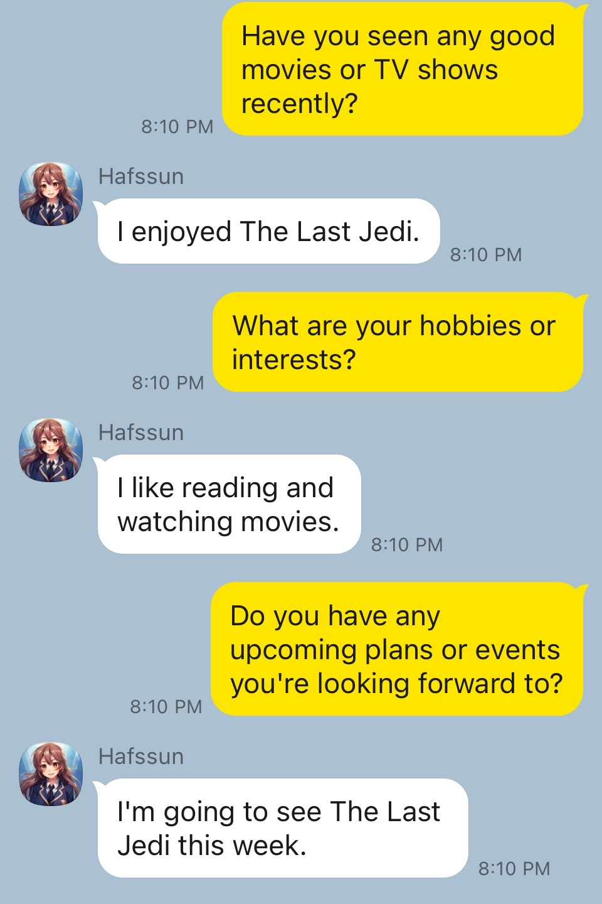
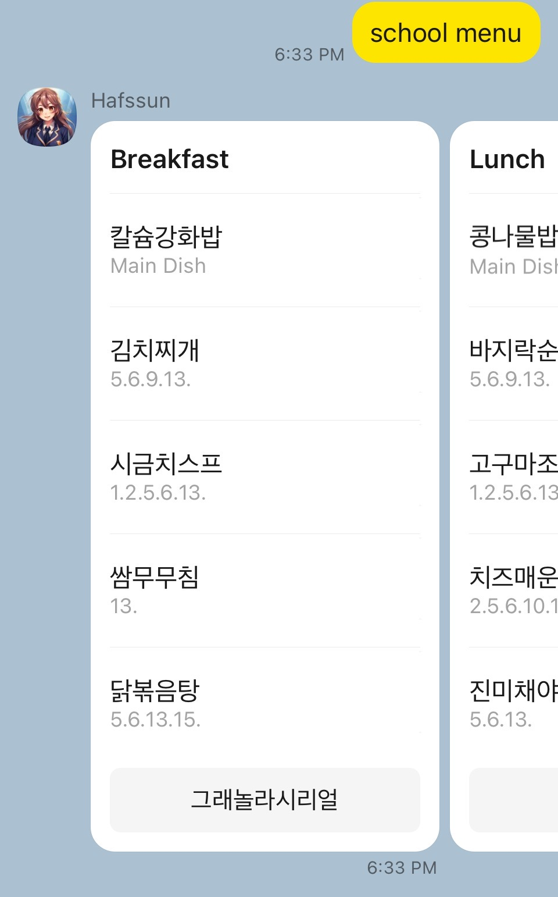

# KakaoOBT_KoboldAI
This is a Kakaotalk OBT Chatbot Skill Server powered by KoboldAI Client.

# Chatbot API with Flask

This repository contains a Flask-based chatbot API powered by KoboldAI. The API allows users to interact with a chatbot, and it also provides an endpoint for retrieving daily food details.
The meal information is based on Yongin Foreign Language High School, so the function should be modified according to the meal of the relevant school in South Korea. If KoboidAI does not have a separate GPU server, it is recommended to use Colab Pro +. 
Refer to the link: `https://github.com/KoboldAI/KoboldAI-Client`

## Project Structure

The main Python script `app.py` runs the Flask server and handles the API routes. The `Characters` directory contains JSON files for different characters the chatbot can adopt.

## Installation

Follow these steps to install and run the project.

### 1. Clone the Repository

First, clone the repository to your local machine using `git`:

git clone https://github.com/<your-github-username>/<your-repo-name>

### 2. Install Dependencies

Navigate to the project directory:

Use `pip` to install the dependencies from `requirements.txt`:

pip install -r requirements.txt

### 3. Run the Server

Now you're ready to start the server:

python app.py

The server should now be running at `http://0.0.0.0:80`.

## API Endpoints

This server provides two main API endpoints:

### Chatbot API - `/chatbot`

This POST endpoint allows users to interact with the chatbot. The request body should be a JSON object containing a `userRequest` object, which contains `utterance` (the message from the user) and `user` (details about the user).

The response from this endpoint will be the chatbot's response to the user's message.

You first need to setup Kakao OBT, and add Skill Server.(How to: `https://i.kakao.com/`)

### Food API - `/food`

This POST endpoint provides daily food details. The request body should be a JSON object containing a `userRequest` object, which contains `utterance` (the message from the user).

The response from this endpoint will be the daily food menu.
You must change the school code variable, `your_sch_code`.(How to find Korean School Code: `http://jubsoo2.bscu.ac.kr/src_gogocode/src_gogocode.asp`) 

## Contributing

We welcome contributions to this project, whether they are bug reports, improvement suggestions, or pull requests. Please use the GitHub issue tracker for this.
